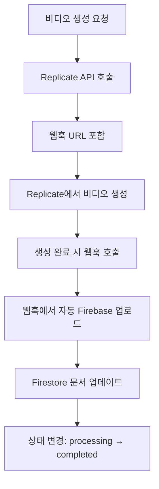

# 백엔드 자동 처리 시스템

## 📋 **개요**

이 시스템은 **사용자가 사이트에 접속하지 않아도** 자동으로 비디오를 Firebase에 업로드하고 상태를 업데이트하는 백엔드 기반 자동화 시스템입니다.

## 🔧 **구성 요소**

### 1. **웹훅 기반 자동 업로드**

- **경로**: `/api/video/news/webhook`
- **동작**: Replicate에서 비디오 생성 완료 시 자동 호출
- **기능**:
  - 비디오 자동 Firebase 업로드
  - Firestore 문서 자동 업데이트
  - 상태 자동 변경 (processing → completed)

### 2. **자동 업로드 API**

- **경로**: `/api/video/news/auto-upload-to-firebase`
- **동작**: 수동 트리거 또는 백엔드에서 호출
- **기능**: 개별 씬 Firebase 업로드

## 🔄 **작동 흐름**



## **설정 방법**

### 1. **환경 변수 설정**

```bash
# .env.local 파일에 추가
NEXT_PUBLIC_APP_URL=https://your-domain.com
WEBHOOK_SECRET=your_webhook_secret
```

### 2. **Replicate 웹훅 설정**

- 비디오 생성 시 자동으로 웹훅 URL이 포함됨
- 별도 설정 불필요

## **모니터링**

### 1. **로그 확인**

- 웹훅 처리: `🔔 Replicate 웹훅 수신`
- 자동 업로드: ` Scene X 자동 Firebase 업로드 시작`
- 완료: `✅ Scene X Firebase 업로드 완료`

### 2. **상태 확인**

- Firebase Storage에서 업로드된 파일 확인
- Firestore에서 문서 상태 확인

## 🎯 **장점**

1. **완전 자동화**: 사용자 접속 불필요
2. **실시간 처리**: 비디오 생성 완료 즉시 업로드
3. **상태 동기화**: 모든 시스템 간 상태 일치
4. **확장성**: 대량의 비디오도 자동 처리

## 🔒 **보안**

- 웹훅 시크릿 검증
- 사용자별 데이터 격리
- 권한 기반 접근 제어

## 🚨 **문제 해결**

### 웹훅이 호출되지 않는 경우

1. Replicate API 토큰 확인
2. 웹훅 URL 접근 가능 여부 확인
3. 방화벽 설정 확인

### 업로드가 실패하는 경우

1. Firebase 권한 확인
2. 스토리지 할당량 확인
3. 네트워크 연결 상태 확인
